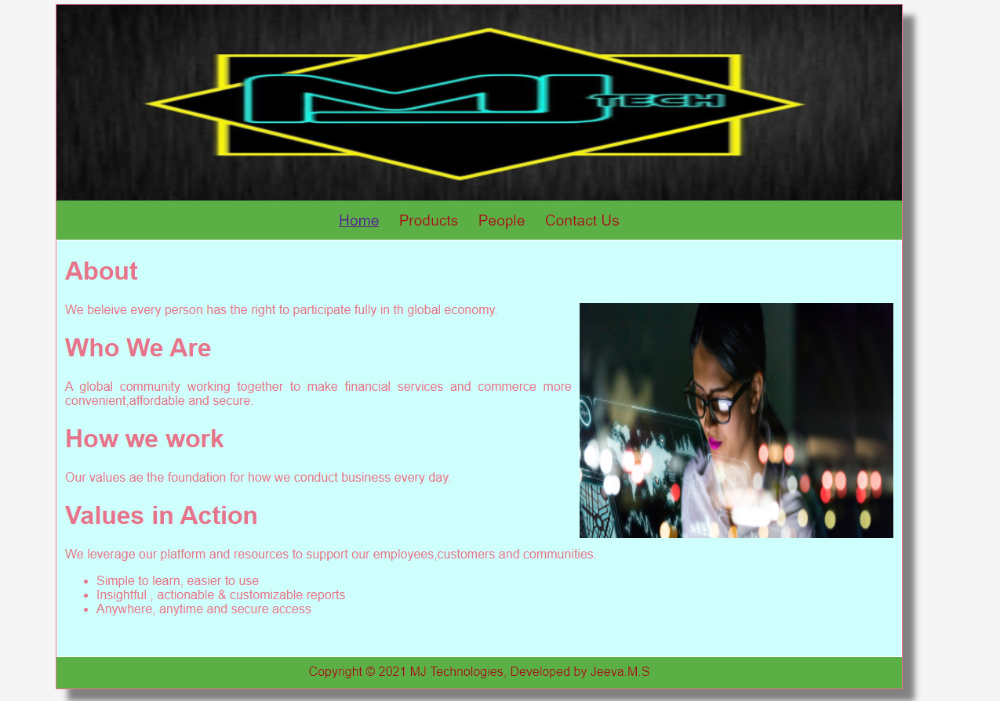
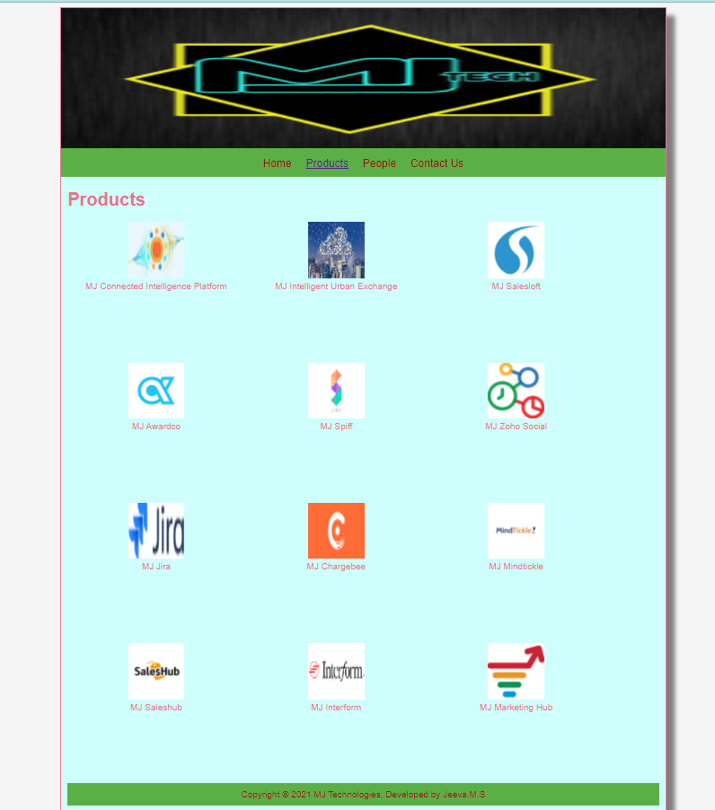
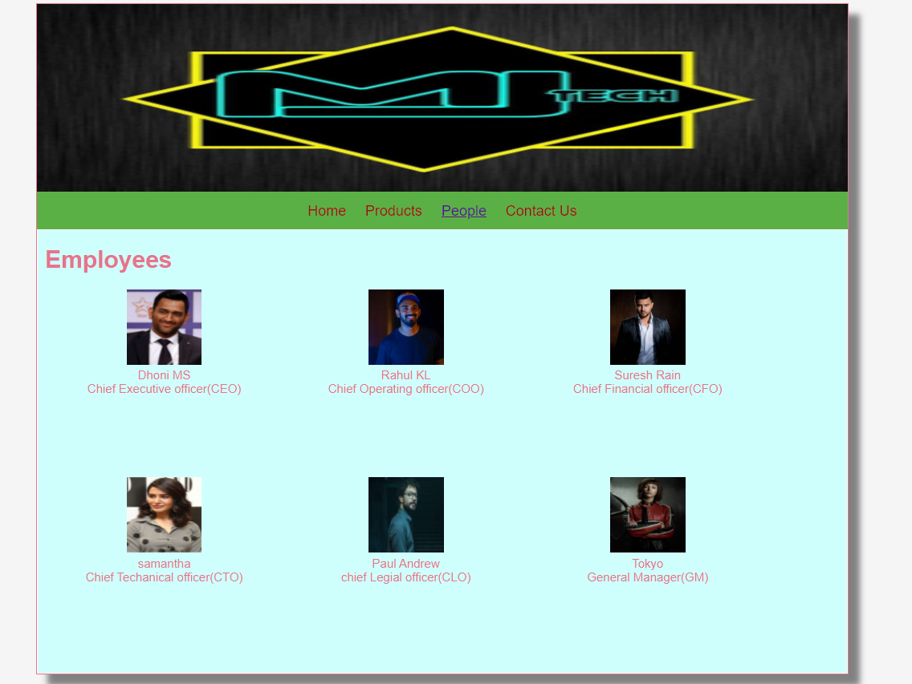
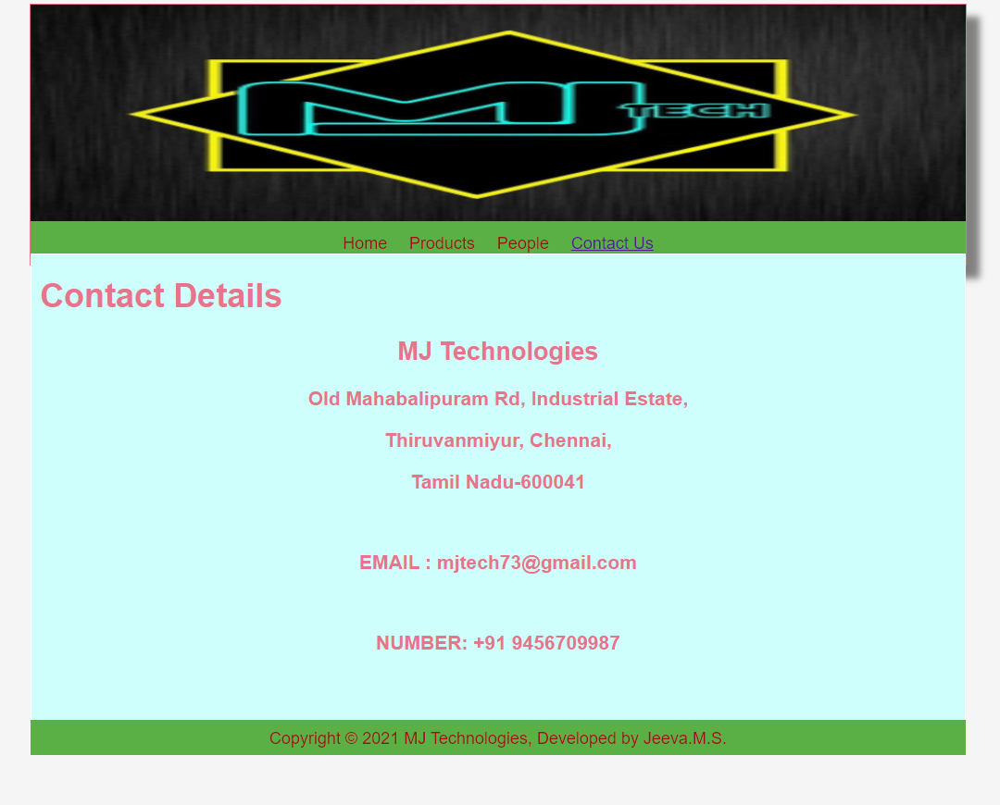

# Web Design for a Software Product Company

## AIM:

To design a static website for a software product company company.

## DESIGN STEPS:

### Step 1:

Requirement collection.

### Step 2:

Creating the layout using HTML and CSS.

### Step 3:

Updating the sample content.

### Step 4:

Choose the appropriate style and color scheme.

### Step 5:

Validate the layout in various browsers.

### Step 6:

Validate the HTML code.

### Step 6:

Publish the website in the given URL.

## PROGRAM :

### Home Page:
<!DOCTYPE html>
<html lang="en">
  <head>
    <title>MJ TECHNOLOGIES PVT.LTD</title>
    <link rel="stylesheet" href="./css/layout.css" />
    <link rel="icon" href="./ourlogo.jpg" type="image/x-icon" />
  </head>

  <body>
    

      

      

        
<a href="/static/home.html">Home</a>

        
<a href="/static/products.html">Products</a>

        
<a>People</a>

        
<a>Contact Us</a>

      

      

        

          <h1>About</h1>
          
          

            We beleive every person has the right to participate fully in th global economy.
            <h1>Who We Are</h1>A global community working together to make financial services and commerce more convenient,affordable and secure.
            <h1>How we work</h1>Our values ae the foundation for how we conduct business every day.
            <h1>Values in Action</h1>We leverage our platform and resources to support our employees,customers and communities.
            <ul>
              <li>Simple to learn, easier to use</li>
              <li>Insightful , actionable & customizable reports</li>
              <li>Anywhere, anytime and secure access</li>
            </ul>
          

        

      

      

        Copyright &#169; 2021 MJ Technologies, Developed by Jeeva.M.S
      

    

  </body>
</html>

### PRODUCT PAGE:

<!DOCTYPE html>
<html lang="en">
  <head>
    <title>MJ TECHNOLOGIES</title>
    <link rel="stylesheet" href="./css/layout.css" />
    <link rel="icon" href="./img/ourlogo.jpg" type="image/x-icon" />
  </head>

  <body>
    

      

      

        
<a href="/static/home.html">Home</a>

        

          <a href="/static/products.html">Products</a>
        

        
<a>People</a>

        
<a>Contact Us</a>

      

      

        
    
          <h1>Products</h1>
          

              
 
                  

                  
                  

                  
MJ Connected Intelligence Platform

                  

                  
 
                  

                  
                  

                  
MJ Intelligent Urban Exchange

                  

                  
 
                    

                    
                    

                    
MJ Salesloft
  
                  

                  

                    
 
                        

                        
                        

                        
MJ Awardco

                        

                        
 
                        

                        
                        

                        
MJ Spiff

                        

                        
 
                          

                          
                          

                          
MJ Zoho Social
  
                        

                        

                          
 
                              

                              
                              

                              
MJ Jira

                              

                              
 
                              

                              
                              

                              
MJ Chargebee

                              

                              
 
                                

                                
                                

                                
MJ Mindtickle
  
                              

                              

                                
 
                                    

                                    
                                    

                                    
MJ Saleshub

                                    

                                    
 
                                    

                                    
                                    

                                    
MJ Interform

                                    

                                    
 
                                      

                                      
                                      

                                      
MJ Marketing Hub
  
                                    

          

          
        
      

      

        Copyright &#169; 2021 MJ Technologies, Developed by Jeeva.M.S
      

    

  </body>
</html>

### PEOPLE PAGE:

<!DOCTYPE html>
<html lang="en">
  <head>
    <title>MJ TECHNOLOGIES</title>
    <link rel="stylesheet" href="./css/layout.css" />
    <link rel="icon" href="./img/ourlogo.jpg" type="image/x-icon" />
  </head>

  <body>
    

      

      

        
<a href="/static/home.html">Home</a>

        

          <a href="/static/Products.html">Products</a>
        

        
<a href="/static/people.html">People</a>

        
 <a href="/static/contactus.html">Contact Us</a>

      

      

        
    
          <h1>Employees</h1>
          

              
 
                  

                  
                  

                  
Dhoni MS

                  
Chief Executive officer(CEO)

                  

                  
 
                  

                  
                  

                  
Rahul KL

                  
Chief Operating officer(COO)

                  

                  
 
                    

                    
                    

                    
Suresh Rain
  
                    
Chief Financial officer(CFO)

                  

                  

                    
 
                        

                        
                        

                        
samantha

                        
Chief Techanical officer(CTO)

                        

                        
 
                        

                        
                        

                        
Paul Andrew

                        
chief Legial officer(CLO)

                        

                        
 
                            

                            
                            

                            
Tokyo

                            
General Manager(GM)

                            

### CONTACT US PAGE:

<!DOCTYPE html>
<html lang="en">
  <head>
    <title></title>
    <link rel="stylesheet" href="./css/layout.css" />
    <link rel="icon" href="./img/icon.png" type="image/x-icon" />
  </head>
  <body>
    

      

      

        
<a href="/static/home.html">Home</a>

        
<a href="/static/products.html">Products</a>

        
<a href='/static/people.html'>People</a>

        

            <a href='/static/contactus.html'>Contact Us</a>
      

      

        
    
          <h1>Contact Details</h1>
          

            <h2>MJ Technologies</h2>
            <h3> Old Mahabalipuram Rd, Industrial Estate,</h3>
            <h3>Thiruvanmiyur, Chennai, </h3>
            <h3>Tamil Nadu-600041</h3>
           
            <h3>EMAIL : mjtech73@gmail.com</h3>
           
            <h3>NUMBER: +91 9456709987s</h3>
          

          
        
      

      

        Copyright &#169; 2021 MJ Technologies, Developed by Jeeva.M.S.
      

    

  </body>
</html>

## OUTPUT:

### HTML VALIDATOR:

## Result:

Thus a website is designed for the software product company and the HTML,CSS code are validated.
